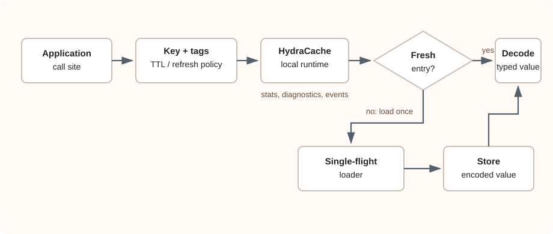
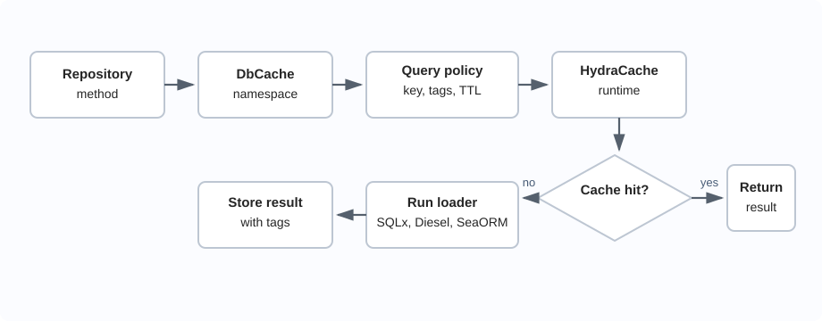
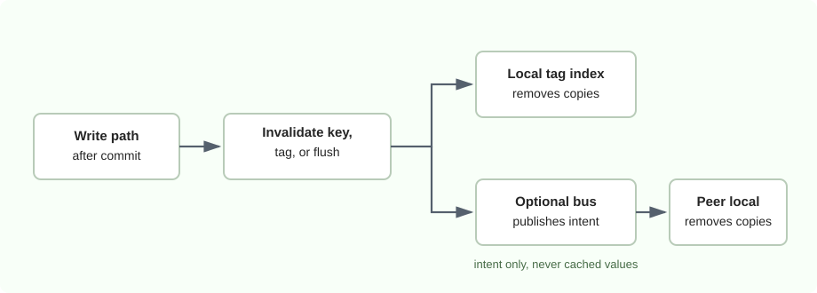

# Architecture

HydraCache is built as a set of explicit cache boundaries rather than one invisible cache layer.

The local runtime owns typed serialization, TTL, tags, single-flight loading, diagnostics, and event streams. Database adapters build query-result descriptors on top of that runtime. Distributed invalidation and cluster APIs carry invalidation intent and membership metadata without hiding the local cache.

## Runtime Flow

<figure class="architecture-diagram">
  
</figure>

On a hit, the runtime decodes and returns the cached value. On a miss, `get_or_load` runs a loader and stores the result under the chosen key and tags. Concurrent same-key misses share one in-flight loader.

## Query Flow

<figure class="architecture-diagram">
  
</figure>

HydraCache does not parse SQL or infer table dependencies. The application names the result and the writes that can invalidate it.

## Invalidation Flow

<figure class="architecture-diagram">
  
</figure>

The bus propagates intent, not values. This keeps distributed behavior local-first: each process remains responsible for its own cache contents and loader code.

## Cluster Flow

Client/member cluster mode adds role, node id, generation, membership, ownership, and peer-fetch vocabulary. It does not turn HydraCache into a production data grid by itself.

Use cluster APIs when the application needs stable membership diagnostics or a future route toward owner-based peer reads. Keep local cache semantics visible even when multiple processes participate.
