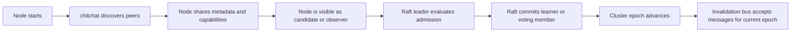

# HydraCache 0.20.0 Chitchat + Raft Cluster Idea

Status: design note.

Date: 2026-06-10.

## Core Idea

Use `chitchat` and `raft-rs` together, but keep their responsibilities
strictly separate.

`chitchat` should provide soft, eventually consistent knowledge about the
cluster:

- peer discovery;
- liveness and failure detection;
- node metadata;
- node capabilities;
- advertised invalidation endpoints;
- advertised actuator/diagnostics endpoints;
- process restart generation.

`raft-rs` should provide hard, committed cluster decisions:

- accepted cluster members;
- voting members;
- learners;
- cluster epoch;
- future ownership or partition maps;
- future metadata that must survive races and network partitions.

The existing HydraCache invalidation bus should remain the fast data path for
cache invalidation messages. Raft should not be used to commit every
`invalidate_key`, `invalidate_tag`, `remove`, or `flush`.

## Why Chitchat Is Attractive

`chitchat` is a good fit for HydraCache because it solves the first distributed
problem without forcing the project to become a full distributed database.

Advantages:

- Gossip-based discovery avoids a central coordinator.
- Seed nodes are only bootstrap points, not the full static cluster list.
- Phi-accrual failure detection is more adaptive than a fixed timeout.
- Per-node versioned metadata can spread role, version, capabilities, and
  endpoint information.
- `generation_id` helps distinguish a restarted process from an older stale
  node instance.
- The source includes a transport abstraction and in-memory transport, which
  makes cluster behavior easier to test.
- It is much lighter than adopting the full `libp2p` stack for the first
  member-mode release.

## Why Chitchat Is Not Enough

`chitchat` is eventual and gossip-based. That is useful for discovery and
health, but it is not a consensus system.

It should not directly decide:

- who is a voting member;
- who owns cache partitions;
- which cluster epoch is authoritative;
- whether a joining node has been admitted safely;
- whether a removed node is still allowed to publish cluster-control events.

Those decisions belong in a consensus/control-plane layer, which is where
`raft-rs` becomes useful.

## Combined Flow

## Practical Rule

Treat `chitchat` as "how nodes learn about each other".

Treat `raft-rs` as "how the cluster agrees on what is true".

Treat the HydraCache invalidation bus as "how cache freshness messages move
fast".

## Suggested 0.20.0 Direction

The first implementation step should be a small cluster-core spike:

- define `ClusterNodeId`, `ClusterGeneration`, `ClusterRole`, and
  `ClusterEpoch`;
- define discovery events such as `CandidateSeen`, `MemberLive`,
  `MemberSuspect`, and `MemberDead`;
- keep these types independent of `chitchat` and `raft-rs`;
- add an in-memory test discovery implementation;
- only then add a chitchat-backed adapter as an optional experiment.

This keeps HydraCache local-first while creating a clean path toward member
mode, P2P-style discovery, and eventually Raft-backed cluster metadata.
