# HydraCache 0.20.0 Cluster Formation Library Analysis

Status: design analysis.

Date: 2026-06-10.

## Goal

HydraCache 0.19.0 introduced an in-process invalidation bus. The next
distributed step is deciding how a future cluster mode should discover peers,
track membership, admit voting members, and propagate invalidations without
forcing applications to run Redis, NATS, Postgres, or another external bus.

This document analyzes the downloaded Rust cluster/runtime candidates and
records how their ideas can be reused by HydraCache.

Paths in this document use two forms:

- Repo-root relative paths from `C:\Workspace\prj\jq\cashe\hydracache`, such as
  `../cluster_libs/raft-rs`.
- Markdown source links from this file, such as
  [raft-rs README](../../../cluster_libs/raft-rs/README.md).

## Downloaded Source Roots

| Library | Local source path | Upstream repository | Main role |
| --- | --- | --- | --- |
| chitchat | `../cluster_libs/chitchat` | <https://github.com/quickwit-oss/chitchat> | Gossip membership, failure detection, metadata spread |
| raft-rs | `../cluster_libs/raft-rs` | <https://github.com/tikv/raft-rs> | Consensus core for committed metadata and membership changes |
| rust-libp2p | `../cluster_libs/rust-libp2p` | <https://github.com/libp2p/rust-libp2p> | P2P identity, transport, discovery, pub/sub, request/response |
| ractor | `../cluster_libs/ractor` | <https://github.com/slawlor/ractor> | Actor-style node/session supervision and distributed actor patterns |
| Coerce-rs | `../cluster_libs/Coerce-rs` | <https://github.com/LeonHartley/Coerce-rs> | Actor cluster, sharding, heartbeat, pub/sub, singleton references |

`foca` was discussed earlier as a SWIM membership candidate, but it is not
present in the downloaded `cluster_libs` directory yet. It should be analyzed
separately if we want a lower-level SWIM-only alternative to chitchat.

## High-Level Recommendation

Use a layered design instead of asking one library to be "the cluster":

1. Discovery plane: find reachable peer candidates.
2. Membership plane: decide which candidates are live, suspect, dead, or
   removed.
3. Admission plane: decide which live candidates are allowed to become cluster
   members.
4. Consensus plane: commit durable cluster metadata with Raft.
5. Invalidation plane: propagate cache invalidation intent quickly and
   asynchronously.

The strongest candidate architecture is:

- `chitchat` first for lightweight member discovery, heartbeats, liveness, and
  node metadata in server/Kubernetes-style deployments.
- `raft-rs` later for committed control-plane state: cluster epoch, voting
  members, learners, owner table, and feature flags.
- `rust-libp2p` as an optional P2P transport/discovery module when the product
  explicitly needs "no static peer list" across less controlled networks.
- `ractor` and `Coerce-rs` as design references, not direct dependencies.

Most importantly, Raft should not be on the hot invalidation path. It should
protect control-plane decisions. High-rate invalidation messages should continue
to use the `CacheInvalidationBus` abstraction.

## Can Raft and P2P Discovery Be Combined?

Yes, and the combination is attractive, but only if the responsibilities are
kept separate.

P2P discovery can find candidates. Raft must still decide whether a candidate is
allowed to become a voting member. A gossip or P2P event must never directly
mutate the Raft voter set.

Recommended flow:

```mermaid
flowchart LR
    A["Node starts"] --> B["P2P or gossip discovery finds peers"]
    B --> C["Candidate exchanges identity and capabilities"]
    C --> D["Candidate joins as non-voting observer or client"]
    D --> E["Current Raft leader validates admission policy"]
    E --> F["Leader proposes ConfChangeV2"]
    F --> G["Raft commits learner or voter membership"]
    G --> H["Cluster metadata epoch advances"]
    H --> I["Invalidation bus uses committed epoch in messages"]
```



This gives us the pleasant operational shape of P2P discovery while keeping the
hard safety boundary in Raft.

"No static peer list" should be interpreted carefully. A system still needs a
bootstrap mechanism:

- mDNS for local development or LAN demos.
- Kubernetes/DNS/headless service for server deployments.
- libp2p rendezvous, Kademlia, relay, or known bootnodes for P2P deployments.
- A genesis config for the first Raft voter or initial voter set.

So the realistic goal is "no static full member list", not "no bootstrap
knowledge at all".

## raft-rs Analysis

Source highlights:

- [README](../../../cluster_libs/raft-rs/README.md)
- [src/lib.rs](../../../cluster_libs/raft-rs/src/lib.rs)
- [src/raw_node.rs](../../../cluster_libs/raft-rs/src/raw_node.rs)
- [src/config.rs](../../../cluster_libs/raft-rs/src/config.rs)
- [five-node example](../../../cluster_libs/raft-rs/examples/five_mem_node/main.rs)
- [ConfChange tests](../../../cluster_libs/raft-rs/harness/tests/integration_cases/test_raw_node.rs)

What it provides:

- A mature Raft consensus core.
- `RawNode` as the main integration point.
- `tick`, `step`, `propose`, `has_ready`, `ready`, and `advance` lifecycle.
- `Ready` batches containing entries to persist, messages to send, snapshots,
  hard state, committed entries, and light-ready output.
- Dynamic membership through `ConfChange` and `ConfChangeV2`.
- Joint consensus support for safer membership transitions.
- Config knobs such as election ticks, heartbeat ticks, pre-vote,
  check-quorum, max in-flight messages, and read-only mode.

What it does not provide:

- No network transport.
- No discovery.
- No persistent log implementation beyond examples/test storage.
- No application state machine.
- No cluster management policy.

HydraCache ideas to take:

- Use `raft-rs` for a future `hydracache-cluster` control-plane catalog.
- Store committed cluster metadata as a small replicated state machine:
  `cluster_epoch`, `members`, `learners`, `node_capabilities`,
  `partition_owner_table`, and `invalidation_bus_epoch`.
- Use `ConfChangeV2` for controlled member admission/removal.
- Start new nodes as non-voting candidates or learners before promotion.
- Keep Raft message transport behind a HydraCache trait so we can use TCP,
  QUIC, libp2p request-response, or a test transport.

Risks:

- Integration cost is high because HydraCache must implement storage,
  transport, snapshots, message routing, and application of committed entries.
- Raft should not be used as a broadcast bus for every invalidation. That would
  make invalidation latency and throughput dependent on consensus.
- Dynamic membership needs admission policy and operator-facing diagnostics.

Recommended use:

Use `raft-rs` only after the membership/discovery layer is proven. It is the
right tool for durable cluster metadata, not for first-pass invalidation
synchronization.

## chitchat Analysis

Source highlights:

- [README](../../../cluster_libs/chitchat/README.md)
- [chitchat/Cargo.toml](../../../cluster_libs/chitchat/chitchat/Cargo.toml)
- [configuration.rs](../../../cluster_libs/chitchat/chitchat/src/configuration.rs)
- [server.rs](../../../cluster_libs/chitchat/chitchat/src/server.rs)
- [failure_detector.rs](../../../cluster_libs/chitchat/chitchat/src/failure_detector.rs)
- [types.rs](../../../cluster_libs/chitchat/chitchat/src/types.rs)
- [state.rs](../../../cluster_libs/chitchat/chitchat/src/state.rs)
- [transport/mod.rs](../../../cluster_libs/chitchat/chitchat/src/transport/mod.rs)
- [cluster tests](../../../cluster_libs/chitchat/chitchat/tests/cluster_test.rs)

What it provides:

- Gossip-based cluster membership.
- Scuttlebutt-style delta reconciliation.
- Phi-accrual failure detection.
- Per-node state namespaces where a node edits only its own state.
- Versioned key/value metadata and tombstone handling.
- `ChitchatId` with `node_id`, `generation_id`, and gossip advertise address.
- UDP transport plus a transport trait and in-memory channel transport for
  tests.
- DNS seed refresh for seed nodes.
- Watch-based live-node notifications.
- Optional catch-up callback when a node is too far behind.

HydraCache ideas to take:

- Model a node identity with stable node id plus restart generation. This maps
  well to avoiding stale invalidation emitters after process restart.
- Expose live/dead/suspect node diagnostics separately from cache stats.
- Use gossip metadata for low-rate cluster data: node capabilities, bus
  endpoint, actuator endpoint, crate version, MSRV, role, and health.
- Keep seed configuration small. A seed is only a bootstrap path, not the
  cluster truth.
- Add a catch-up path later for nodes that missed too many invalidations.

Risks:

- chitchat is eventual and gossip-based. It is not a consensus layer.
- It can be used as "reliable broadcast with caveats", but those caveats matter
  for correctness.
- UDP may be inconvenient in some locked-down environments.
- The current local source uses edition 2024 and Rust 1.86. That is compatible
  with HydraCache's newer MSRV direction, but should be checked before adding a
  dependency.

Recommended use:

Use chitchat as the first serious candidate for member-mode discovery and
liveness. Pair it with the existing invalidation bus abstraction. Do not treat
chitchat membership as Raft membership.

## rust-libp2p Analysis

Source highlights:

- [README](../../../cluster_libs/rust-libp2p/README.md)
- [libp2p/Cargo.toml](../../../cluster_libs/rust-libp2p/libp2p/Cargo.toml)
- [libp2p/src/lib.rs](../../../cluster_libs/rust-libp2p/libp2p/src/lib.rs)
- [SwarmBuilder](../../../cluster_libs/rust-libp2p/libp2p/src/builder.rs)
- [gossipsub protocol](../../../cluster_libs/rust-libp2p/protocols/gossipsub/src/lib.rs)
- [Kademlia protocol](../../../cluster_libs/rust-libp2p/protocols/kad/src/lib.rs)
- [mDNS protocol](../../../cluster_libs/rust-libp2p/protocols/mdns/src/lib.rs)
- [request-response protocol](../../../cluster_libs/rust-libp2p/protocols/request-response/src/lib.rs)
- [identify protocol](../../../cluster_libs/rust-libp2p/protocols/identify/src/lib.rs)

What it provides:

- P2P identity with `PeerId`.
- `Swarm` and `NetworkBehaviour` composition.
- TCP, QUIC, WebSocket, TLS/noise, yamux, relay, hole punching, DNS, and other
  transport building blocks.
- mDNS for LAN discovery.
- Kademlia for peer discovery/routing.
- gossipsub for pub/sub style message propagation.
- request-response for direct protocol messages.
- identify/ping/autonat/relay/rendezvous components for real P2P deployment
  shapes.

HydraCache ideas to take:

- Optional "P2P member mode" without requiring a static full peer list.
- Map HydraCache `NodeId` to stable application identity, and keep libp2p
  `PeerId` as the network identity.
- Use request-response or direct streams for Raft messages. Avoid running Raft
  over gossipsub.
- Use gossipsub only for best-effort invalidation broadcasts when eventual
  propagation is acceptable.
- Use mDNS for local sandbox demos and Kademlia/rendezvous for wider P2P
  experiments.

Risks:

- It is a large dependency surface for an embeddable cache library.
- P2P networking has operational complexity: NAT, relay, peer scoring,
  authentication, bootstrap, and abuse controls.
- The downloaded workspace has `rust-version = "1.88.0"`, which currently fits
  HydraCache but leaves less room for lowering MSRV.

Recommended use:

Do not make libp2p part of the core crate. If we use it, create an optional
published crate such as `hydracache-cluster-libp2p` or keep it experimental
behind a feature until the API is stable.

## ractor Analysis

Source highlights:

- [README](../../../cluster_libs/ractor/README.md)
- [ractor_cluster README](../../../cluster_libs/ractor/ractor_cluster/README.md)
- [ractor_cluster/src/lib.rs](../../../cluster_libs/ractor/ractor_cluster/src/lib.rs)
- [ractor_cluster/src/node.rs](../../../cluster_libs/ractor/ractor_cluster/src/node.rs)
- [distributed playground](../../../cluster_libs/ractor/ractor_playground/src/distributed.rs)

What it provides:

- Actor model with supervision and process groups.
- `ractor_cluster` for remote actor sessions.
- `NodeServer`, `NodeSession`, remote actor references, connection
  authentication, and process-group synchronization.
- External transport hook through `ClusterBidiStream`.
- Node event subscriptions for session lifecycle events.

HydraCache ideas to take:

- Structure future cluster internals as supervised tasks with explicit
  lifecycle boundaries: listener, session, discovery, invalidation receiver,
  raft driver, and diagnostics reporter.
- Provide event subscriptions for node/session lifecycle.
- Keep transport injection small and trait-based.
- Use a `NodeServer`-like owner component for member mode, while preserving
  HydraCache's library-first API.

Risks:

- The README says `ractor_cluster` should not be considered production ready.
- It would pull HydraCache toward a full actor framework dependency.
- HydraCache does not need remote actor semantics for its core product.

Recommended use:

Use ractor as an implementation-pattern reference. Do not depend on it for the
first cluster release.

## Coerce-rs Analysis

Source highlights:

- [README](../../../cluster_libs/Coerce-rs/README.md)
- [remote module](../../../cluster_libs/Coerce-rs/coerce/src/remote/mod.rs)
- [cluster worker builder](../../../cluster_libs/Coerce-rs/coerce/src/remote/cluster/builder/worker.rs)
- [node discovery](../../../cluster_libs/Coerce-rs/coerce/src/remote/cluster/discovery/mod.rs)
- [Kubernetes discovery](../../../cluster_libs/Coerce-rs/providers/discovery/coerce-k8s/src/lib.rs)
- [system topic](../../../cluster_libs/Coerce-rs/coerce/src/remote/stream/system.rs)
- [heartbeat](../../../cluster_libs/Coerce-rs/coerce/src/remote/heartbeat/mod.rs)
- [cluster formation test](../../../cluster_libs/Coerce-rs/coerce/tests/test_remote_cluster_formation.rs)

What it provides:

- Async actor runtime and distributed framework.
- Remote actor system builder with node id and node tag.
- Seed-based cluster worker startup.
- Node discovery that expands from a seed to a discovered node graph.
- Kubernetes discovery provider.
- Heartbeat actor with health checks, node ping status, and leader-change
  notifications.
- System-level pub/sub events such as member-up, node-added, node-removed, and
  leader-changed.
- Distributed sharding and singleton concepts.

HydraCache ideas to take:

- A `ClusterEvent` stream is useful: `MemberUp`, `MemberDown`,
  `LeaderChanged`, `PartitionMapChanged`, `InvalidationLagged`.
- Separate health/heartbeat from membership admission.
- Provide Kubernetes discovery as an optional adapter, not as core logic.
- Sharding and singleton ideas map to future cache-owner routing, but are too
  early for invalidation-only cluster mode.

Risks:

- The local source is on older dependency lines (`coerce` 0.8.12, older Axum
  and protobuf stack). It needs a maintenance review before any dependency
  decision.
- It is a broad framework with actor remoting, sharding, persistence, API, and
  pub/sub. HydraCache should not inherit that full shape.

Recommended use:

Use Coerce-rs as a knowledge reference for event vocabulary, heartbeat, and
seed expansion. Avoid it as a runtime dependency.

## Proposed HydraCache Cluster Shape

Future modules should keep the current local cache clean:

```text
hydracache-core
  cache keys, codecs, stats, events, tags

hydracache
  local async cache, typed cache, in-process invalidation bus

hydracache-cluster-core
  cluster traits, node identity, roles, membership events, admission model

hydracache-cluster-chitchat
  optional chitchat-backed discovery/liveness

hydracache-cluster-raft
  optional raft-rs committed metadata catalog

hydracache-cluster-libp2p
  optional P2P discovery/transport experiment
```

Initial public roles should stay aligned with the product vision:

- `Local`: no distributed dependencies.
- `Client`: near-cache plus remote invalidation/fetch access.
- `Member`: participates in cluster membership and, later, ownership.

Suggested low-level traits:

```rust
pub trait ClusterDiscovery {
    async fn next_event(&mut self) -> ClusterDiscoveryEvent;
}

pub trait ClusterAdmission {
    async fn propose_candidate(&self, candidate: NodeCandidate) -> AdmissionDecision;
}

pub trait ClusterMetadataStore {
    async fn current_epoch(&self) -> ClusterEpoch;
    async fn members(&self) -> Vec<ClusterMember>;
}

pub trait ClusterTransport {
    async fn send_raft_message(&self, target: NodeId, bytes: bytes::Bytes);
    async fn broadcast_invalidation(&self, message: CacheInvalidationMessage);
}
```

The exact traits will need real implementation pressure before they become
public API. Keep them internal or experimental at first.

## Recommended Implementation Sequence

1. Document the cluster model: roles, node identity, epochs, discovered
   candidates, voting members, learners, and invalidation bus semantics.
2. Add internal `ClusterNodeId` and `ClusterGeneration` types without external
   dependencies.
3. Add a non-published or feature-gated `hydracache-cluster-core` spike with
   pure in-memory tests.
4. Add a chitchat-backed discovery prototype. Validate joining, restart
   generation, live/dead transitions, and node metadata.
5. Add a transport-neutral Raft spike only for cluster metadata. Validate:
   leader election, add learner, promote voter, remove member, restart from
   storage.
6. Add sandbox scenarios for two and three members: discovery, membership
   change, invalidation propagation, node restart, and lag diagnostics.
7. Only after the server-style design is stable, decide whether libp2p deserves
   a separate optional crate for P2P-style bootstrap.

## Design Rules

- Keep `HydraCache::local()` dependency-free and fast.
- Do not make cluster features default.
- Do not replicate cached values before invalidation-only clustering is proven.
- Do not let gossip/P2P directly change Raft voting membership.
- Do not put every cache invalidation through Raft.
- Prefer traits and optional crates over one monolithic distributed runtime.
- Make every distributed feature visible through diagnostics and sandbox demos.

## Open Questions

- Should the first cluster crate be unpublished while APIs settle?
- Should the first discovery implementation be chitchat, libp2p mDNS, or a tiny
  internal static-peer test transport?
- Should `Member` mode ever live inside `hydracache`, or always in a separate
  crate?
- What is the smallest durable metadata state machine worth committing with
  Raft?
- What operational story do we want first: Kubernetes/server deployments or
  P2P/local-network deployments?

## Current Decision

Do not jump directly to a full Hazelcast-like runtime.

The best next engineering step is a focused 0.20.0 design/spike around cluster
core types and discovery semantics:

- use chitchat as the primary source of membership ideas;
- keep raft-rs as the planned consensus core for committed metadata;
- keep libp2p optional for future P2P bootstrap;
- use ractor and Coerce-rs as references for node/session lifecycle,
  heartbeat, event vocabulary, and sandbox diagnostics.
