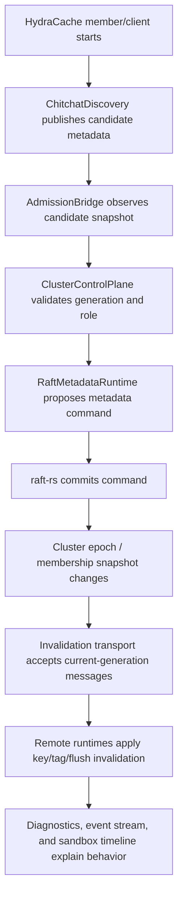

# HydraCache 0.20.0 Cluster Next Steps Plan

Status: implementation status and remaining hardening plan for the 0.20.0
cluster work.

Date: 2026-06-11.

Related documents:

- [Cluster client roadmap](./V0_20_CLUSTER_CLIENT_ROADMAP.md)
- [Chitchat + Raft cluster idea](./V0_20_CHITCHAT_RAFT_CLUSTER_IDEA.md)
- [Cluster discovery adapter plan](./V0_20_CLUSTER_DISCOVERY_ADAPTER_PLAN.md)
- [Cluster control-plane plan](./V0_20_CLUSTER_CONTROL_PLANE_PLAN.md)
- [Cluster formation library analysis](./V0_20_CLUSTER_FORMATION_LIBRARY_ANALYSIS.md)

Related source crates:

- `crates/hydracache`
- `crates/hydracache-cluster`
- `crates/hydracache-cluster-chitchat`
- `crates/hydracache-cluster-raft`
- `crates/hydracache-sandbox`

## Current 0.20.0 Status

Implemented in the current codebase:

- client/member builders and diagnostics in the base `hydracache` crate;
- `hydracache-cluster` composition helpers for wiring discovery and metadata
  adapters together;
- real chitchat-backed discovery in `hydracache-cluster-chitchat`;
- real raft-rs-backed metadata runtime in `hydracache-cluster-raft`;
- admission bridge from discovered candidates into the control plane;
- generation-safe leave and invalidation publish rejection;
- sandbox demos for in-memory lifecycle and real chitchat + raft adapters;
- documentation and release notes for the supported client/member shape.

Still intentionally deferred:

- production multi-node Raft transport;
- durable metadata storage;
- cluster ownership/routing and failover decisions;
- distributed value ownership or owner-side query execution;
- external invalidation transports such as Postgres LISTEN/NOTIFY, Redis, or
  NATS.

## Executive Analysis

HydraCache 0.20.0 has crossed an important boundary: the project now has both
the cluster vocabulary and real opt-in adapter crates.

Already implemented:

- client/member/local roles in the base `hydracache` crate;
- generation-safe membership checks for join, leave, publish, and receive;
- `ClusterDiscovery` as the soft-discovery trait;
- `ClusterControlPlane` as the authoritative metadata trait;
- `hydracache-cluster-chitchat` with real `chitchat::spawn_chitchat`;
- `hydracache-cluster-raft` with real `raft::RawNode<MemStorage>`;
- sandbox coverage for the in-memory cluster lifecycle.

The main gap is composition. Chitchat discovery, Raft metadata, invalidation
transport, diagnostics, and sandbox flows exist as separate pieces. The next
cluster work should connect them into one observable end-to-end loop:

```text
candidate appears in chitchat
  -> bridge proposes admission to control plane
  -> raft commits accepted metadata
  -> runtime accepts generation-safe invalidation messages
  -> diagnostics and sandbox explain the whole flow
```

## Design Boundaries

The cluster design should keep these boundaries strict:

- Chitchat is soft state: discovery, liveness, endpoint metadata, capabilities,
  and graceful-leave markers.
- Raft is hard state: admitted members, admitted clients, generations, epochs,
  and later ownership metadata.
- The invalidation bus is the hot path: key/tag/flush freshness messages move
  quickly and are not committed through Raft.
- Values remain local in the first clustered mode. Distributed value ownership
  is future work.
- `HydraCache::local()` must not depend on chitchat, raft, tonic, or any
  network stack.

Non-goals for the remaining 0.20.0 work:

- no full Hazelcast-like partitioned data grid;
- no remote value loading or owner-side query execution;
- no durable replicated cache values;
- no multi-node Raft transport unless the single-node bridge is stable first;
- no mandatory daemon or proxy process.

## Target Architecture



The long-term ideal is not "one large cluster object that hides everything".
The better shape is layered:

- low-level traits stay public for advanced users;
- adapter crates remain optional;
- a later ergonomic builder composes the adapters for common cases.

## Proposed Crate Shape

Keep the base crate dependency-light:

```text
hydracache
  core cache runtime, traits, in-memory cluster model, invalidation bus

hydracache-cluster-chitchat
  real chitchat-backed discovery

hydracache-cluster-raft
  real raft-rs metadata runtime

future: hydracache-cluster
  optional convenience crate that composes discovery + metadata + invalidation

future: hydracache-cluster-transport-tonic
  optional cross-process invalidation/control transport
```

Do not rush the convenience crate until the bridge, diagnostics, and transport
contracts are stable. Otherwise, the "easy API" will fossilize too early.

## Milestone 1: Chitchat To Raft Admission Bridge

Goal: turn discovered candidates into authoritative metadata proposals.

Why this comes first:

- it connects the two real adapter crates;
- it tests the core design boundary directly;
- it gives the sandbox a meaningful real-cluster story before cross-process
  invalidation exists.

Candidate API shape:

```rust
let bridge = ClusterAdmissionBridge::new(discovery.clone(), control_plane.clone())
    .poll_interval(Duration::from_millis(100))
    .admit_members(true)
    .admit_clients(true);

let handle = bridge.spawn();
```

Bridge responsibilities:

- read `ClusterCandidate` snapshots from a `ClusterDiscovery`;
- classify candidates by role;
- skip candidates already admitted at the same generation;
- reject candidates older than authoritative metadata;
- call `join_member` for member candidates;
- call `join_client` for client candidates;
- emit diagnostics and events for every decision.

Bridge diagnostics:

- candidates seen;
- candidates admitted;
- candidates ignored because already current;
- candidates rejected as stale;
- admission failures;
- last admitted node id;
- last error message.

Testing requirements:

- one chitchat node announces member metadata and the bridge admits it;
- one chitchat node announces client metadata and the bridge admits it;
- repeated candidate at same generation is ignored, not recommitted;
- older generation is rejected and does not increase Raft command count;
- newer generation upgrades membership and advances committed metadata;
- discovery failure does not panic the bridge task;
- bridge shutdown stops polling cleanly.

Suggested location:

- start in `crates/hydracache-cluster-raft` if the bridge is primarily
  control-plane oriented;
- move to a future `crates/hydracache-cluster` convenience crate if it starts
  depending on both chitchat and raft directly.

## Milestone 2: Cluster Membership Event Stream

Goal: make membership behavior observable without repeatedly scraping
snapshots.

Events to expose:

- candidate seen;
- candidate ignored;
- member admitted;
- client admitted;
- node left;
- generation rejected;
- node suspected;
- node dead;
- admission failed;
- bridge stopped.

API options:

```rust
let mut events = control_plane.subscribe_membership();
let event = events.recv().await?;
```

or:

```rust
let mut events = bridge.subscribe();
```

Recommendation:

- start with bridge-level events because they are narrower and easier to test;
- later promote a stable subset into the base `ClusterControlPlane` trait.

Testing requirements:

- event order is deterministic for one bridge task;
- slow subscribers do not block admission;
- lag is visible in diagnostics;
- events include node id, generation, role, and reason.

## Milestone 3: Generation-Safe Chitchat Leave Semantics

Goal: make graceful leave visible to discovery, not only to authoritative
metadata.

Current behavior:

- `leave_cluster()` removes authoritative metadata when generation matches;
- local cache contents remain intact;
- remote discovery may still see old candidate state until failure detection or
  tombstone propagation catches up.

Desired behavior:

- successful leave writes a chitchat leave marker;
- the marker contains node id, generation, role, and timestamp-like metadata;
- newer generations cannot be tombstoned by older generations;
- discovery diagnostics distinguish graceful leave from suspected/dead nodes.

Possible chitchat keys:

```text
hydracache.lifecycle = leaving
hydracache.left.generation = 7
hydracache.left.role = member
```

Testing requirements:

- current generation leave marker appears in local chitchat state;
- remote discovery observes the leave marker through `ChannelTransport`;
- older generation cannot overwrite a newer generation's active candidate;
- rejoin with a newer generation clears or supersedes the leave marker.

## Milestone 4: Sandbox Real Cluster Demo

Goal: make the real adapters easy to exercise manually.

Add a sandbox route such as:

```text
POST /demo/cluster/real-adapters/run
```

Scenario shape:

- create two `ChitchatDiscovery` instances with `ChannelTransport`;
- create a `RaftMetadataRuntime`;
- start an admission bridge;
- announce one member and one client;
- wait for bridge admission;
- perform member-to-client and client-to-member invalidation checks;
- inject a stale generation publish attempt;
- return timeline, diagnostics, and pass/fail assertions.

Response should include:

- chitchat node ids and generations;
- discovered candidates;
- bridge decisions;
- raft metadata commands;
- cluster diagnostics;
- invalidation counters;
- stale rejection counters;
- timeline suitable for dashboard rendering.

Testing requirements:

- OpenAPI schema includes request/response models;
- route succeeds in a normal unit/integration test without Docker;
- route is visible in `/demo/catalog`;
- dashboard exposes a button or card;
- scenario assertions fail clearly if admission or invalidation does not happen.

## Milestone 5: Cross-Process Invalidation Transport

Goal: move invalidation intent between processes, not only inside one process.

This should come after the admission bridge because transport needs an
authoritative membership/generation source to reject stale messages.

Candidate transport designs:

- tonic bidirectional stream;
- simple TCP framed protocol;
- member relay over a control endpoint;
- later external adapters: Redis Pub/Sub, NATS, Postgres LISTEN/NOTIFY.

Message requirements:

- source node id;
- source generation;
- invalidation kind: key, tag, flush;
- optional logical cluster name;
- optional monotonic message id for diagnostics/idempotency;
- encoding version.

Receiver requirements:

- reject stale source generation before applying;
- suppress self-originated messages;
- do not republish remote invalidations by default;
- update distributed invalidation diagnostics;
- surface reconnect, lag, decode error, and closed receiver states.

Testing requirements:

- two independent runtimes communicate through the transport;
- stale source generation is rejected;
- receiver close increments diagnostics;
- publish failure returns an error to the caller;
- reconnect does not duplicate already applied invalidation in the same test
  window.

## Milestone 6: Raft Runtime Hardening

Goal: prepare the raft-rs runtime for durable and multi-node metadata.

Current runtime:

- real `raft::RawNode<MemStorage>`;
- single-node leader campaign;
- metadata command proposal;
- `Ready` draining;
- stable-log append into `MemStorage`;
- committed-entry application.

Next hardening tasks:

- storage abstraction for Raft log and applied metadata;
- recovery from stored log and applied index;
- idempotent command ids;
- explicit command result reporting;
- snapshot export/import;
- separation between committed Raft log and materialized membership view;
- later multi-node message transport;
- later `ConfChangeV2` learner/voter promotion/removal.

Testing requirements:

- command idempotency prevents duplicate admission after retry;
- runtime can rebuild materialized metadata from committed entries;
- snapshot can be exported and imported in memory;
- stale generation rejection still does not commit a command;
- failed proposal does not mutate materialized metadata.

## Milestone 7: Ergonomic Cluster Builder API

Goal: avoid forcing common users to assemble every adapter manually.

Potential API shape:

```rust
let cluster = HydraCluster::builder("orders")
    .node_id("member-a")
    .generation(ClusterGeneration::new(1))
    .chitchat_udp("127.0.0.1:7000")
    .seed("127.0.0.1:7001")
    .raft_single_node(1)
    .build()
    .await?;

let cache = HydraCache::member()
    .cluster_runtime(cluster)
    .start()
    .await?;
```

Design rule:

- this must be a convenience layer over public traits;
- it must not replace `.discovery(...)` and `.control_plane(...)`;
- it must not make local-only applications depend on chitchat or raft.

Suggested location:

- future `hydracache-cluster` crate, not the base `hydracache` crate.

## Implementation Order

Recommended sequence:

1. Add bridge diagnostics structs and bridge event types.
2. Implement a polling admission bridge against existing `ClusterDiscovery`
   and `ClusterControlPlane`.
3. Add chitchat `ChannelTransport` tests for member/client admission.
4. Add raft command-count tests for ignored/stale/upgraded candidates.
5. Add sandbox real-adapter demo.
6. Add bridge event stream and wire it into sandbox timeline.
7. Add chitchat graceful-leave marker support.
8. Add cross-process invalidation transport spike.
9. Harden raft runtime storage/recovery.
10. Add ergonomic cluster builder only after the lower layers stop moving.

## Risk Register

| Risk | Why It Matters | Mitigation |
| --- | --- | --- |
| Discovery accidentally becomes authoritative | Chitchat is eventual and can be stale | Keep admission in `ClusterControlPlane`; tests must prove stale candidates do not commit |
| Raft enters invalidation hot path | Every invalidation would become slow and over-coordinated | Raft commits metadata only; invalidation transport remains separate |
| Builder API freezes unstable internals | Early convenience can become hard to change | Delay ergonomic builder until bridge and transport contracts are stable |
| Multi-node Raft scope explodes | Raft transport and storage are large tasks | Keep 0.20.0 to single-node state-machine plus bridge; document deferred work |
| Local users pay distributed dependency cost | This weakens HydraCache's main product shape | Keep chitchat/raft in optional crates |
| Stale generation bug reappears through transport | Old processes may still emit messages | Require source generation in every cluster transport message and validate before apply |

## Release Checklist Additions

Before publishing 0.20.0 with this work, run:

```powershell
cargo fmt --all -- --check
cargo check --workspace --all-targets --locked
cargo test --workspace --locked
cargo clippy --workspace --all-targets --all-features --locked -- -D warnings
cargo doc --workspace --no-deps --locked
```

Also run focused adapter tests:

```powershell
cargo test -p hydracache-cluster-chitchat --locked
cargo test -p hydracache-cluster-raft --locked
cargo test -p hydracache-sandbox --locked
```

Package verification for cluster adapter crates requires `hydracache 0.20.0` to
be visible in the crates.io index first because they depend on the runtime
crate.

## Success Criteria

The remaining 0.20.0 cluster work is meaningfully complete when:

- chitchat-discovered candidates can be admitted automatically;
- stale generations cannot leave, publish, be admitted, or be applied;
- raft-rs committed metadata reflects accepted membership changes;
- bridge diagnostics explain admitted, ignored, rejected, and failed
  candidates;
- sandbox demonstrates discovery to admission to invalidation to stale
  rejection;
- local-only `hydracache` users still do not pay for chitchat or raft
  dependencies.

## Deferred Beyond 0.20.0

Likely 0.21+ work:

- multi-node raft-rs transport;
- durable raft metadata storage;
- ownership maps and partition metadata;
- remote value loading through owner members;
- client reconnect protocol with backoff;
- external invalidation bus adapters;
- production-grade member/client security and authentication.
